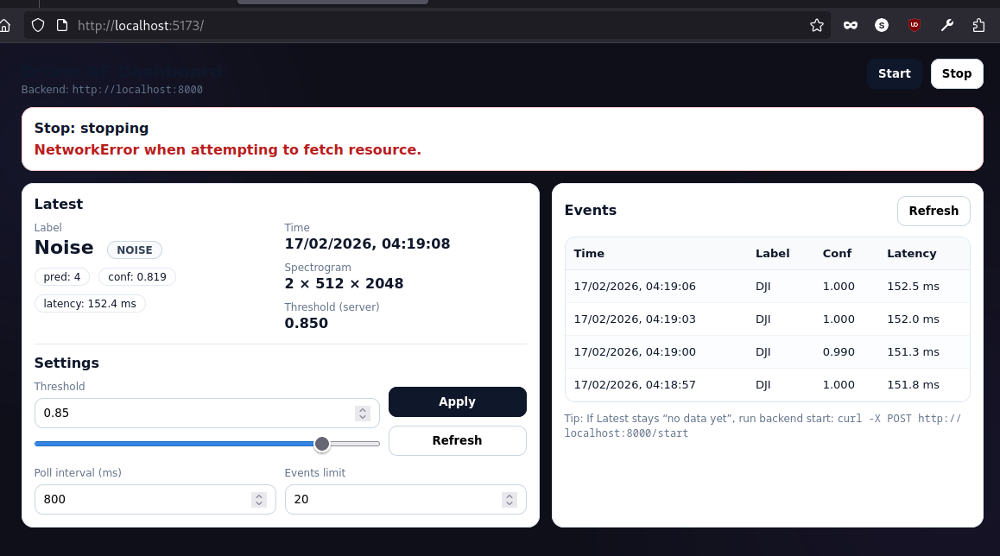

# RF-Based Commercial Drone Detection and Classification Prototype

A deep learning–based prototype system for detecting and classifying **commercial drones** using **radio frequency (RF) signal analysis**.

This project was developed as an **academic research prototype** for studying RF signal–based drone identification using low-cost methods.

---

## 📌 Project Purpose

This repository presents a **research-oriented prototype**, not a full production system.

Goals of the study:

- Explore **RF signal characteristics** of commercial drones  
- Apply **deep learning (CNN)** for signal classification  
- Build a **real-time inference prototype** with backend + dashboard  
- Evaluate feasibility of **low-cost RF drone detection**

This work focuses on **academic experimentation and validation**, rather than deployment as a commercial security product.

---

## 🧠 Dataset

Training and evaluation use the public dataset:

**Noisy Drone RF Signal Classification v2**  
https://www.kaggle.com/datasets/sgluege/noisy-drone-rf-signal-classification-v2

⚠️ The dataset (~150GB) is **not included** in this repository.

Place dataset manually in:
Robust-Drone-Detection-and-Classification/data/drone_RF_data/


---

## 🧪 Base Research Code

Model training pipeline adapted from:

https://github.com/sgluege/Robust-Drone-Detection-and-Classification

Academic modifications in this prototype:

- Adjusted preprocessing and dataset handling  
- Tuned training configuration for experimentation  
- Added real-time inference backend  
- Implemented web dashboard for live visualization  

---

## 🏗️ System Overview

Prototype processing pipeline:
RF IQ Signal → Spectrogram Transformation → CNN Classification → Prediction Output → Web Dashboard


This architecture demonstrates the **feasibility of RF-based drone classification in an experimental setting**.

---

## 📂 Repository Structure

backend/ FastAPI real-time inference prototype
frontend/ React visualization dashboard
tests_area/ Experimental validation scripts
Robust-Drone-Detection-and-Classification/
├── training and evaluation code
└── data/ (dataset excluded from Git)

---

## ⚙️ Running the Backend Prototype

```bash
cd backend
uvicorn app:app --host 0.0.0.0 --port 8000
```
Available API endpoints:

| Endpoint    | Method | Purpose                    |
| ----------- | ------ | -------------------------- |
| `/start`    | POST   | Start inference loop       |
| `/stop`     | POST   | Stop inference             |
| `/latest`   | GET    | Latest prediction result   |
| `/events`   | GET    | Detection history          |
| `/settings` | POST   | Adjust detection threshold |

---

## 🖥️ Frontend Dashboard
```bash
cd frontend
npm install
npm run dev
```


